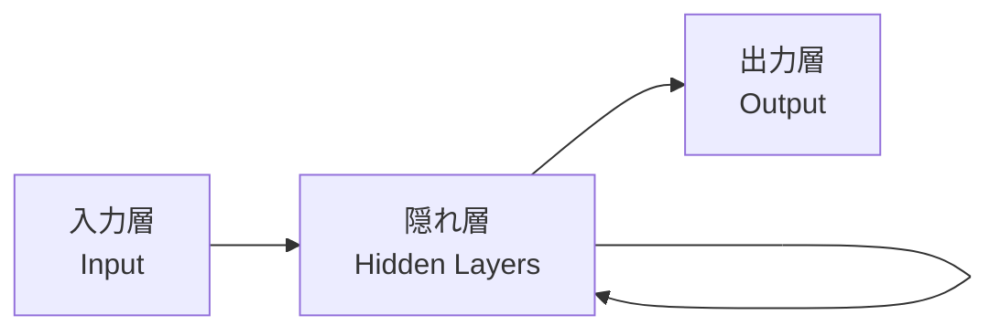
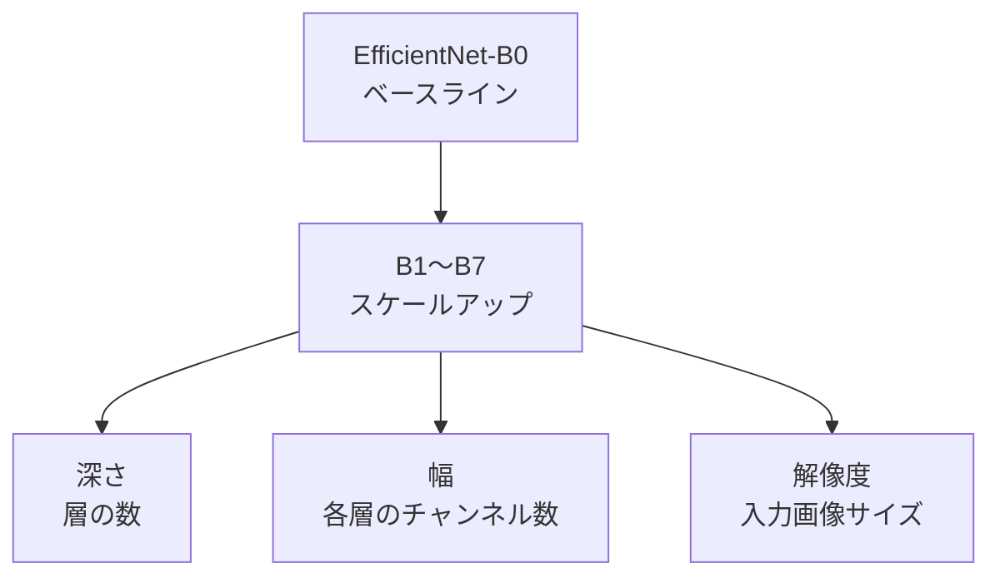

# アーキテクチャ

ニューラルネットワークの「構造の設計図」。
何層あるか、各層がどんな変換をするか、どう繋がるかを定義したもの。
アーキテクチャ自体はただの型紙であり、学習するのは**重み**。

---

## ニューラルネットワークの基本構造

- **入力層**: データを受け取る。メルスペクトログラムなら画像のピクセル値
- **隠れ層**: 特徴を段階的に抽象化する変換を繰り返す
- **出力層**: タスクに応じた出力を出す。BirdCLEFなら「各種の確率」

各層は「入力 × 重み + バイアス → 活性化関数」という変換を行う。
層を深くするほど、より複雑な特徴を捉えられるようになる。

---

## CNN（畳み込みニューラルネットワーク）

画像に特化したアーキテクチャ。

### 畳み込み層（Convolutional Layer）

小さなフィルター（カーネル）を画像全体にスライドさせ、局所的なパターンを検出する。
浅い層は「エッジ・テクスチャ」、深い層は「形状・物体」を捉えるようになる。

重要な性質：**パターンが画像のどこに現れても検出できる**（位置不変性）

### プーリング層（Pooling Layer）

空間サイズを縮小する。細かい位置の違いに対してロバストになる。
計算コストも下げる。

### なぜメルスペクトログラムにCNNが使えるか

メルスペクトログラムは**2次元の画像**（横軸：時間、縦軸：周波数）。
鳥の鳴き声は周波数パターンとして現れる。
CNNはこの空間的パターンを自然に検出できる。

---

## EfficientNet

Googleが2019年に提案したCNNアーキテクチャ。
「深さ・幅・解像度」の3つをバランスよくスケールさせる**複合スケーリング**が特徴。

- **B0**: 最小・最速
- **B3**: 精度と速度のバランスが良い（今の実験で使用中）
- **B7**: 最大・最高精度だが重い

スケールアップすれば精度は上がるが、学習時間とメモリも増える。

---

## 出力層とタスクの関係

Transfer Learningでは、事前学習済みモデルの出力層だけを差し替える。

出力層のサイズ = 分類するクラス数（BirdCLEF 2026の鳥の種数）

---

## 疑問・未整理

- 活性化関数（ReLUなど）は何をしているか
- Batch Normalizationの役割
- EfficientNetV2とEfficientNetの違い
