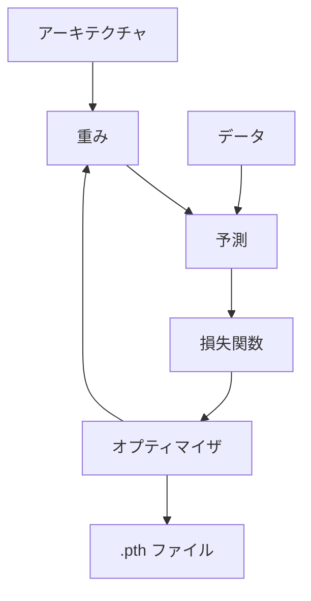

# PyTorch 概念マップ

## 概念一覧

| 概念 | 一言 | ページ |
|------|------|--------|
| 全体の流れ / Transfer Learning | PyTorchが何をするか、外部モデルの活用 | [overview](overview.md) |
| アーキテクチャ | モデルの構造（形） | architecture.md |
| 重み | モデルが学ぶパラメータ | weights.md |
| 損失関数 | 予測のズレを数値化する | loss.md |
| オプティマイザ | 重みを更新する仕組み | optimizer.md |
