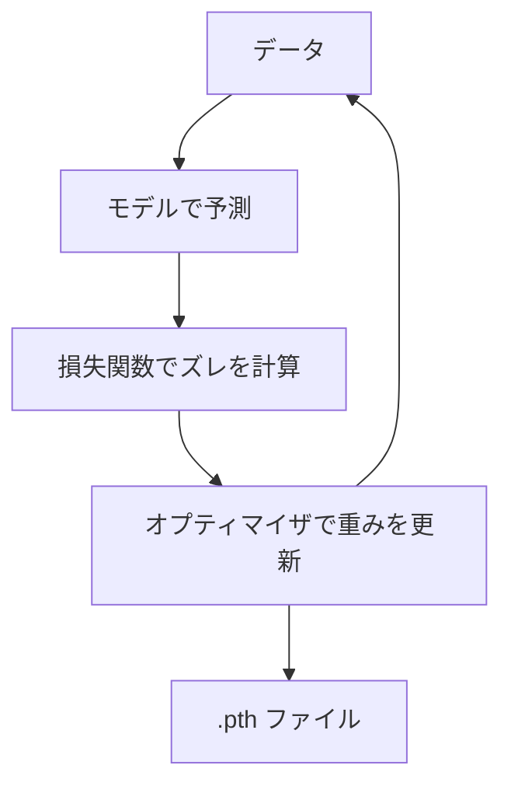
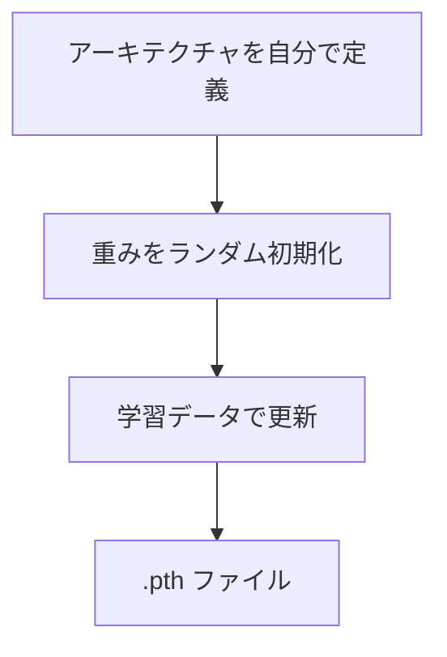
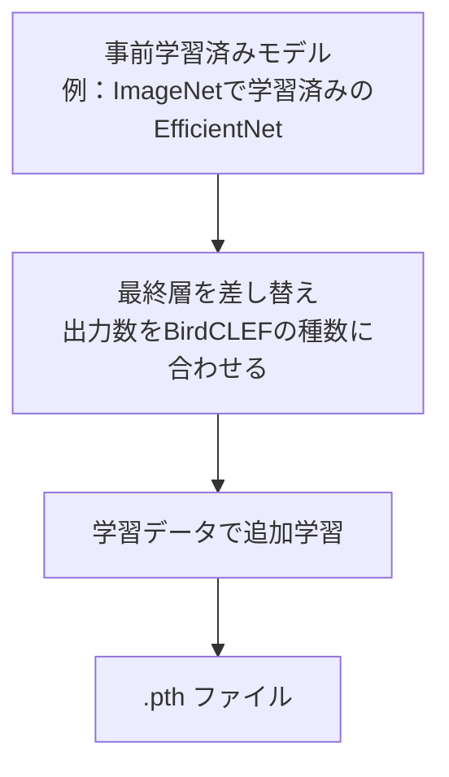

# PyTorchと学習の流れ

## PyTorchが何をしているか

データを受け取り、予測を出し、ズレを減らす方向に重みを更新し続ける。
その結果として `.pth`（重みファイル）を出力する。

---

## 本来の流れ vs 簡略化した流れ

### 本来の流れ（スクラッチ）

アーキテクチャを自分で設計し、重みをランダムな状態から学習する。

### 簡略化した流れ（Transfer Learning）

別のタスクで大量データを使って学習済みのモデルを持ってくる。
最終層だけ差し替えて、自分のタスク用に追加学習（Fine-tuning）する。

---

## なぜTransfer Learningを使うか

- スクラッチでは大量のデータと時間が必要
- 事前学習済みモデルはすでに「画像の特徴を捉える力」を持っている
- 音をメルスペクトログラム（画像）に変換することで、画像認識モデルがそのまま使える

---

## 疑問・未整理

- Fine-tuningと特徴抽出（Feature Extraction）の違いは？
- timmとは何か（モデルのライブラリ）
